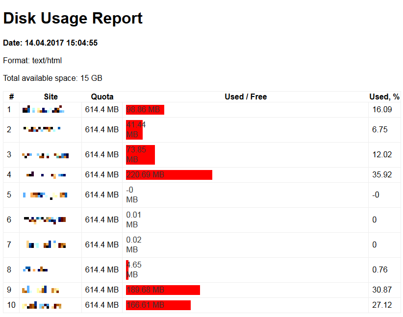

# php-du-notifier
PHP script to notify an admin by email of how much space allocated by web sites on shared Linux hosting.

## Install

Download and copy files to your shared hosting. 

### Mail report every moth
Allow to execute `du-notifier.php`, e.g. `chmod +x du-notifier.php` to allow run from cron.
Configure cron task to run `/path-to-scripts/du-notifier.php -m mailme@example.org` for example once a month.
It will send you a letter with a report once a month.

### Instant report
Open your web site at http://site.com/path-to-scripts/du-notifier.php to see the html report.
Set password for this folder to protect it from undesired access.

## Email Report Example

The letter in Gmail interface.

## Online HTML Report Example

See below.

